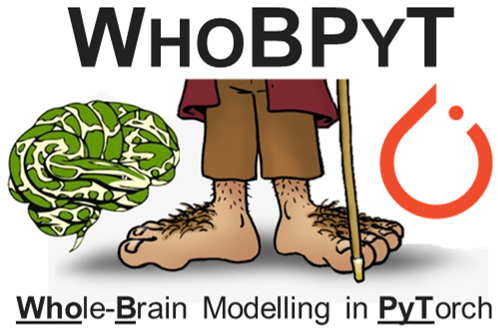

:html_theme.sidebar_secondary.remove:

.. title:: MNE

.. The page title must be in rST for it to show in next/prev page buttons.
   Therefore we add a special style rule to only this page that hides h1 tags

.. raw:: html

    

WhoBPyT Homepage
===================

.. LOGO

.. image:: _static/mne_logo_dark.svg
   :alt: MNE-Python
   :class: logo, mainlogo, only-dark
   :align: center

.. rst-class:: h4 text-center font-weight-light my-4

   Whole-Brain Modeling in PyTorch

.. frontpage gallery is added by a conditional in _templates/layout.html

.. toctree::
   :hidden:

   Install <install/index>
   Documentation <documentation/index>
   API Reference <api/python_reference>
   Get help <help/index>
   Development <development/index>
